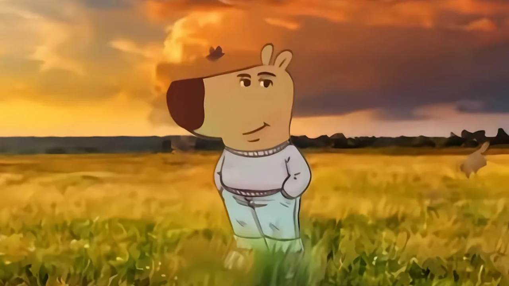

# тыквенное зелье змее-кошки

а теперь, когда я получил твоё внимание, я тебе расскажу пару вещей:

---

# важное упоминание, актуальное на момент создания репозитория

тут ничего нет. иди отсюда. я это сделал именно сейчас ради отдушины и чтобы начать разработку игры не на пустом месте, а на готовом блюдечке с голубой каёмочкой.

считай, что я создал этот readme как направляющую, в каком-то смысле. вдруг я забуду, как собирается мой проект, или где что должно лежать - я приду сюда. или просто захочу перечитать сиё глупое творение, заключённое в формат markdown :D

приходи сюда через полгода, путник. тут наверняка уже будет что-то большое и играбельное. а если ты это читаешь в репозитории и дата в календаре перевалила за ноябрь 2025 года - хахах...

---

## сборка
установи cmake у себя на компе. так же у тебя должен быть компилятор c++ и для простоты - твой комп должен работать на windows.

вручную этот проект собирается в два (три) шага:

0. открой терминал в папке (директории) проекта.
1. введи в терминал: `cmake -B build` , эта команда будет выполняться долго. в этот момент будут загружаться библиотеки из интернета и подгатавливаться исходники для сборки игры. ждать придётся возможно минут полчаса, я тебя предупредил. команда должна закончиться строкой по типу: `-- Build files have been written to: C:/Users/goat5ucker/source/repos/glitchbashers-game/build`
2. введи в терминал: `cmake --build build --config Release`, это ~~взломает пентагон~~ соберёт игру. если последней строкой было `  glitchbashers.vcxproj -> C:\Users\goat5ucker\source\repos\glitchbashers-game\output\Debug\glitchbashers.exe` - значит всё прошло успешно. готовый файл будет лежать в папке `./output/Release/glitchbashers.exe`, запусти его из проводника и наслаждайся жизнью.

---

## немного об исходниках игры

за графику отвечает библиотека `SFML` версии 3.0.1, за интерфейсы отвечает `Dear ImGUI`, ~~за звук отвечает `un4seen/BASS`~~, а за хранение и обработку данных отвечает `tinyxml2`. ссылки на использованное добро лежат в графе `HONORABLE MENTIONS` внизу этого README.

в хедере utils лежат:
- обработчик XML-файлов с данными об игре и настройками
- прочие штуки, которые сделали разработку игры чуть проще

в хедере settings располагается код, с помощью которого:
- изменяются параметры игры

в хедере player есть штуки, которые:
- загружают спрайт игрока
- заставляют спрайт игрока двигаться

в хедере level присутствуют приколы, обрабатывающие:
- загрузку уровня
- отрисовку текущего уровня
- коллайдер спрайта игрока

## HONORABLE MENTIONS

>  SFML:\
> [основной репозиторий с библиотекой](https://github.com/SFML/SFML)\
> \\\
>  а так же [шаблон с ImGUI](https://github.com/SFML/cmake-sfml-project/tree/imgui-sfml) (списибо, облегчили жизнь)

> Dear ImGUI:\
> [основной репозиторий](https://github.com/ocornut/imgui) 

> ~~un4seen BASS:~~\
> ~~[ссылка на сайт проекты](https://www.un4seen.com/)~~

> TinyXML2:\
> [основной репозиторий](https://github.com/leethomason/tinyxml2)

---

## License

GNU GENERAL PUBLIC LICENSE v3
